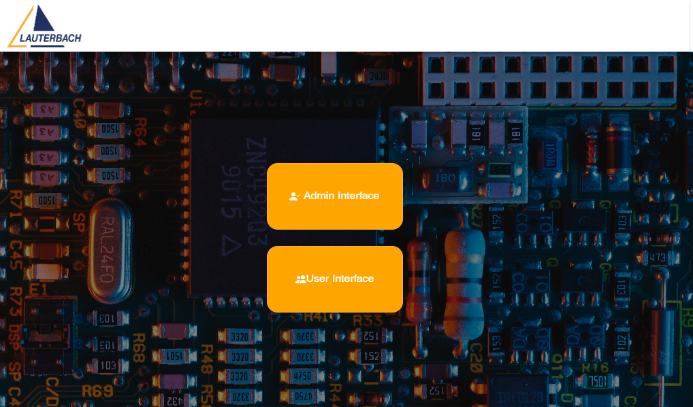
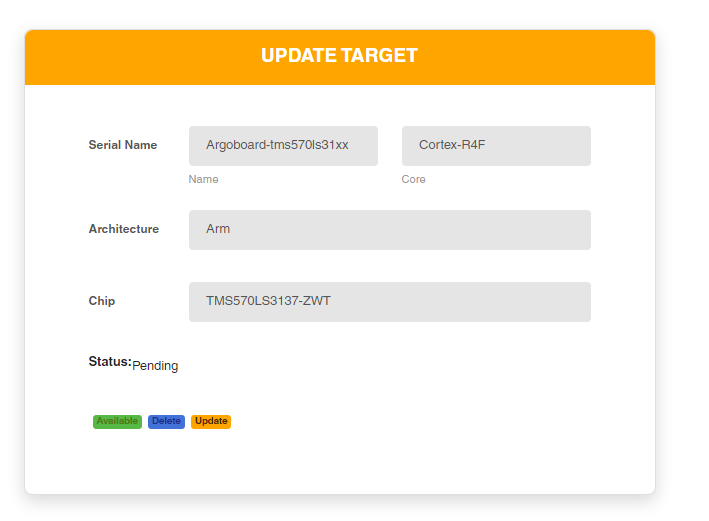
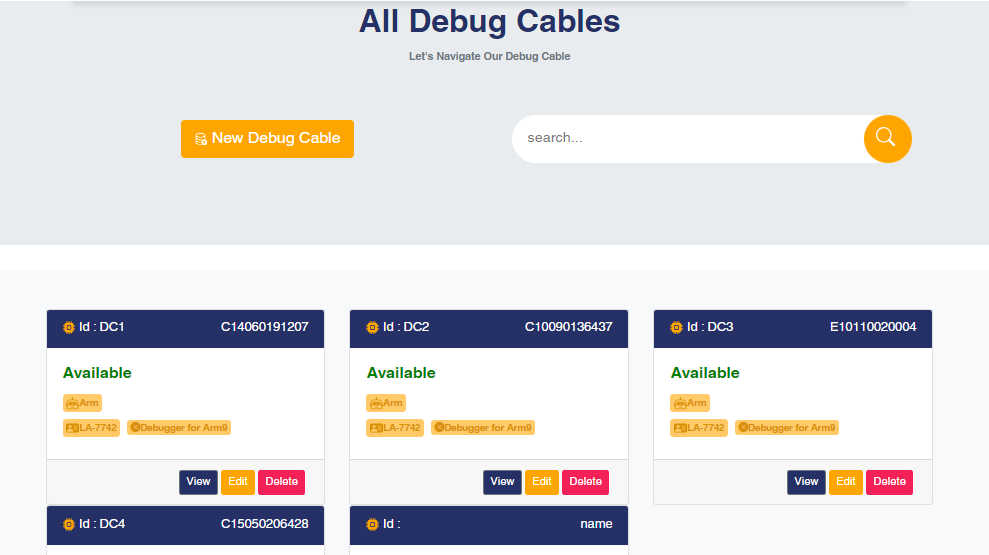

<h2> Target Room Frontend Project</h2>

<h4>💻 About The Project</h4> 
In this project ,i will show you how to build a Full Stack Application. the frontend is build using Angular V16 which represent the client side and th backend use Springboot which is server side.

<h4> Built With</h4>

  

<h4>Guides</h4>

<h4>Other Ressource</h4> 

<h2>🔐 Instalation,Configurationand Usage </h2> 
<h4>Instal Prerequisites:</h4> 
<ul>
<li>Install Angular CLI :
<code>npm install -g @angular/cli</code></li>

<li>Install Node.js  and npm from official website : https://nodejs.org/</li>
</ul>
<h4>Add Material Design:</h4>
<code>ng add @angular/material</code>

<h4>Add jQuery and Boostrap:</h4>
<code>
npm install bootstrap
npm install jquery
</code>

<h2>⚙️ Getting Started</h2> 
<h4> Instalation</h4>
<ol>
  <li>Clone repo</li>
<code>https://github.com/EmnaSallemi/TARGET_ROOM_Stage.git</code>

<li>Installing Dependencies</li>
 <code>npm install</code>

<li>Starts the Development Server</li>

  <ul>
    <li>For Windows:</li>
    <code>ng serve</code>
    
    <li>For Linux:</li>
    <code>npx ng serve -o</code>
  </ul>
</ol>
<h2>🚀 Usage</h2> 

<h4>> Development server</h4

Run <code>ng serve</code> for a dev server. Navigate to http://localhost:4200/. The application will automatically reload if you change any of the source files.

### 💪Demo
#### Admin Interface

1. login page

2. Choose interface <strong>(Sauf for coder)</strong>

3. Admin Interface 

- When i click on Manage User 

- When i click on Add user:

- Edit User

- Delete User

- View Details 

4. Manage Target Boards 

- Target Details 

- Target Edit 

5. Lauterbach Products

- Exemple of Debug Cable of Lauterbach Products

- Manage categories 

#### User Interface 

1. Home

2. Target Boards

- Target Board Details

 -In case target available : 
 

 -In case target not available :

3. Lauterbach Products 

#### Code scaffolding

Run <code>ng generate component component-name</code> to generate a new component. You can also use <code>ng generate directive|pipe|service|class|guard|interface|enum|module</code>.

<h4>Build</h4> 

Run <code>ng build</code> to build the project. The build artifacts will be stored in the dist/ directory.Use the<code>--configuration productrion</code> flag for a production build.

<h4> Running unit tests</h4>
Run ng test to execute the unit tests via https://karma-runner.github.io.

<h4>Running end-to-end tests</h4>

Run <code>ng e2e</code> to execute the end-to-end tests via a platform of your choice. To use this command, you need to first add a package that implements end-to-end testing capabilities.
<h4>Further help</h4>

To get more help on the Angular CLI use <code>ng help</code> or go check out the [Angular CLI Overview and Command Reference](https://angular.io/cli) page.

<h2>🔍 Contributing</h2>

Contributions are what make the open source community such an amazing place to be learn, inspire, and create. Any contributions you make are <strong>greatly appreciated</strong>.
<ol>
  <li>Fork the Project.</li>

  <li>Create your Feature Branch <code>git checkout -b feature/AmazingFea</code></li>

  <li>Commit your Changes <code>git commit -m 'Add some AmazingFeature</code>)</li>

  <li>Push to the Branch <code>git push origin feature/AmazingFeature</code></li>

  <li>Open a Pull Request.</li>
  </ol>

  <h2>Hosting</h2>
  <ol>
  <li>Install Required Software:</li>
  Make sure you have the following software installed on your Linux server:
  <ul>
      <li>Node.js and npm (for Angular)</li>
      <li>Java Runtime Environment (JRE) or Java Development Kit (JDK) (for Spring Boot)</li>
      <li>MySQL </li>
  </ul>
    <li>Set Up MySQL Database:</li>
    Install MySQL on your server and create a database for your application. You'll need to configure a database user and grant necessary permissions.
    <li>Build Angular Application:</li>
    Navigate to your Angular project directory and build the application using the ng build command. This will generate static HTML, CSS, and JavaScript files in the dist directory.
    <li>Build Spring Boot Application:</li>
    Build your Spring Boot application using your preferred build tool (e.g., Maven or Gradle). This will generate a JAR or WAR file containing your backend code.
    <li>Deploy Spring Boot Application:</li>
    Deploy your Spring Boot application by running the generated JAR or WAR file. You can use the java -jar command to start the application.
    <li>Configure Web Server:</li>
    Set up a web server (e.g., Apache or Nginx) to serve the Angular frontend files. Configure the server to point to the dist directory generated by the Angular build.
    <li>Configure Domain and Hosts:</li>
    Edit your server's hosts file to associate a domain name (e.g., myapp.local) with your server's IP address. This allows you to access the application using the domain name.
    <li>Test Your Application:</li>
    Open a web browser and navigate to the configured domain name. You should see your Angular frontend being served by the web server and communicating with the Spring Boot backend.
  </ol>
<h2>📧 Contact</h2>

Emna SALLEMI - <a href="linkedin.com/in/emna-sallemi-8709a5223">linkedin.com/in/emna-sallemi-8709a5223</a>

Project Link: https://github.com/EmnaSallemi/frontend_targetroom.git</a>

